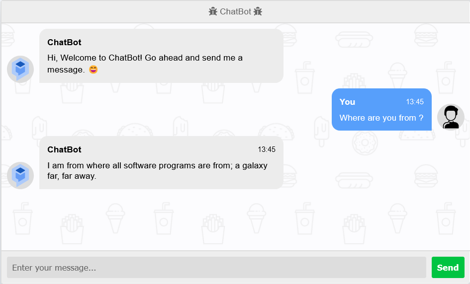

# Simple Chatbot


Simple chatbot application which is created using python's chatterbot package and flask framework.

## Installation
Open Anaconda prompt and create new environment
```
conda create -n your_env_name python = (any_version_number > 3.10.4)
```
Then Activate the newly created environment
```
conda activate your_env_name
```
Clone the repository using `git`
```https://github.com/Prakashdeveloper03/Simple-Chatbot.git
git clone https://github.com/Prakashdeveloper03/Simple-Chatbot.git
```
Change to the cloned directory
```
cd <directory_name>
```
To install all requirement packages for the app
```
pip install -r requirements.txt
```
Then, Run the app
```
python main.py
```

## 📷 Screenshot
